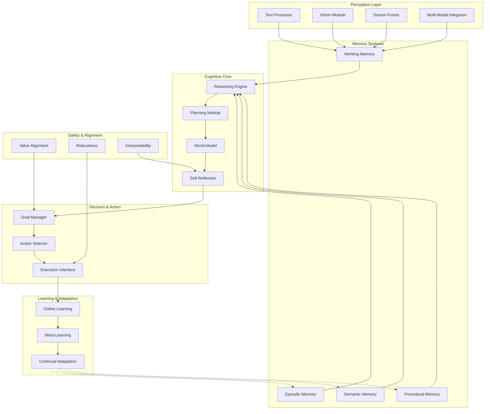

# 🧠 Alex AI Research Lab

**Mission: Building the Foundation for a Next-Generation AI Brain**

---

## 📋 Project Overview

This repository documents the research, design, and development journey toward creating a **modular, autonomous intelligence system** — an AI Brain capable of:

- **Deep Reasoning** — Multi-step logical inference and causal understanding
- **Long-Term Planning** — Strategic goal decomposition and temporal reasoning
- **Structured Memory** — Episodic, semantic, and procedural memory systems
- **Autonomous Decision-Making** — Goal-oriented action selection and execution
- **Multi-Modal Perception** — Text, vision, robotics sensors, and environmental inputs
- **Continuous Learning** — Adaptation and improvement over time
- **Multi-Platform Control** — Robots, drones, digital agents, and distributed systems

## 🎯 Vision: The AI Brain Architecture

The AI Brain is not a single model or chatbot. It is a **modular cognitive architecture** with:



See [Architecture Overview](systems-design/architecture-overview.md) for detailed specifications.

## 📁 Repository Structure

```
alex-ai-research-lab/
├── research-log/              # Daily/weekly research logs
├── notes/                     # Research notes and concepts
│   ├── book-summaries/        # Book summaries
│   └── paper-summaries/       # Concise paper summaries
├── papers/                    # Detailed paper reviews
├── experiments/               # Experiment plans and results
├── ideas/                     # Raw ideas and brainstorming
├── systems-design/            # Architecture blueprints
│   ├── memory/                # Memory system designs
│   ├── reasoning/             # Reasoning engine designs
│   ├── planning/              # Planning module designs
│   ├── safety/                # Safety framework designs
│   └── architecture-overview.md
├── models/                    # Model implementations
├── datasets/                  # Dataset documentation
├── templates/                 # Document templates
└── docs/                      # Documentation
    ├── concepts/              # Core concept definitions
    ├── roadmap.md             # Research roadmap
    └── research-workflow.md   # Workflow guidelines
```

## 🔬 Research Focus Areas

### 1. **Perception Modules**
- Multi-modal input processing
- Sensor fusion for robotics
- Attention mechanisms
- Feature extraction and representation

### 2. **Memory Systems**
- Episodic memory architectures
- Semantic knowledge graphs
- Working memory management
- Memory consolidation and retrieval

### 3. **Reasoning Engine**
- Symbolic and neural reasoning
- Causal inference
- Analogical reasoning
- Multi-step problem solving

### 4. **Planning & Decision-Making**
- Hierarchical planning
- Temporal reasoning
- Goal decomposition
- Action selection under uncertainty

### 5. **World Model**
- State representation
- Dynamics prediction
- Uncertainty quantification
- Model-based planning

### 6. **Self-Reflection & Meta-Cognition**
- Error detection and correction
- Confidence calibration
- Strategy selection
- Learning from mistakes

### 7. **Robotics & Multi-Platform Integration**
- Robot control interfaces
- Drone autonomy
- Digital agent frameworks
- Distributed system coordination

### 8. **Learning & Adaptation**
- Online learning algorithms
- Meta-learning for rapid adaptation
- Continual learning without catastrophic forgetting
- Self-improvement mechanisms

### 9. **Safety & Alignment**
- Value alignment
- Robustness and reliability
- Interpretability and explainability
- Controllability and oversight

### 10. **Multi-Agent Systems**
- Agent communication protocols
- Distributed coordination
- Collective intelligence
- Emergent behaviors

## 🚀 Getting Started

### For Researchers

1. **Read the Documentation**
   - Start with [Architecture Overview](systems-design/architecture-overview.md)
   - Review [Research Workflow](docs/research-workflow.md)
   - Check [Roadmap](docs/roadmap.md) for current priorities

2. **Use Templates**
   - Research notes: `templates/research-note-template.md`
   - Paper summaries: `templates/paper-summary-template.md`
   - Experiments: `templates/experiment-template.md`
   - See [Templates](templates/) for all templates

3. **Follow Naming Conventions**
   - See [Naming Conventions](docs/naming-conventions.md)
   - Use lowercase with hyphens
   - Be descriptive and specific

4. **Contribute**
   - Read [CONTRIBUTING.md](CONTRIBUTING.md)
   - Follow the research workflow
   - Link related documents

### Quick Links

- **[Architecture Overview](systems-design/architecture-overview.md)** — System design
- **[Roadmap](docs/roadmap.md)** — Research timeline
- **[Research Workflow](docs/research-workflow.md)** — How to contribute
- **[Templates](templates/)** — Document templates
- **[Concepts](docs/concepts/)** — Core module definitions

## 🗺️ Roadmap

### Near-Term (0-3 Months)
- Complete architecture specifications
- Build initial memory and reasoning prototypes
- Establish research baseline

### Medium-Term (3-12 Months)
- Integrate core modules
- Run systematic experiments
- Refine architecture based on results

### Long-Term (1-2 Years)
- Advanced cognitive capabilities
- Multi-agent coordination
- Robotics integration
- Real-world deployment readiness

See [Full Roadmap](docs/roadmap.md) for detailed timeline and milestones.

## 🚀 Current Status

**Phase: Early Research & Design**

This repository is in active development. Current focus:
- Establishing architectural foundations
- Researching state-of-the-art cognitive architectures
- Designing modular system components
- Planning initial experiments

## 📚 Key Research Questions

1. How do we design a memory system that supports both rapid access and long-term consolidation?
2. What reasoning architectures enable both symbolic logic and neural pattern matching?
3. How can planning systems scale from simple tasks to complex multi-step goals?
4. What world model representations best support prediction and planning?
5. How do we enable self-reflection and meta-cognitive capabilities?
6. What interfaces enable seamless control across robots, drones, and digital agents?
7. How can the system learn continuously without catastrophic forgetting?
8. What safety mechanisms ensure reliable and aligned behavior?

## 🤝 Contributing

We welcome contributions! Please see [CONTRIBUTING.md](CONTRIBUTING.md) for guidelines on how to contribute to this research project.

Contributions can include:
- Research notes and documentation
- Paper summaries and reviews
- Architecture designs and proposals
- Experiment plans and results
- Code implementations
- Ideas and discussions

## 📖 Documentation

### Core Documentation
- **[Architecture Overview](systems-design/architecture-overview.md)** — High-level system design
- **[Roadmap](docs/roadmap.md)** — Research timeline and milestones
- **[Research Workflow](docs/research-workflow.md)** — How to conduct research
- **[Naming Conventions](docs/naming-conventions.md)** — File and folder naming rules

### Module Documentation
- **[Memory System](systems-design/memory/memory-overview.md)** — Memory architecture
- **[Reasoning Engine](systems-design/reasoning/reasoning-core.md)** — Reasoning architecture
- **[Safety Framework](systems-design/safety/safety-overview.md)** — Safety mechanisms

### Concept Definitions
- **[Memory Concepts](docs/concepts/memory.md)** — Memory system concepts
- **[Reasoning Concepts](docs/concepts/reasoning.md)** — Reasoning concepts
- **[Planning Concepts](docs/concepts/planning.md)** — Planning concepts
- **[Safety Concepts](docs/concepts/safety.md)** — Safety concepts

### Research Content
- **[Research Log](research-log/)** — Ongoing discoveries and insights
- **[Experiments](experiments/)** — Experimental designs and results
- **[Papers](papers/)** — Detailed paper reviews
- **[Paper Summaries](notes/paper-summaries/)** — Concise paper summaries
- **[Notes](notes/)** — Research notes and technical documentation
- **[Ideas](ideas/)** — Raw ideas and brainstorming

### Templates
- **[Templates Directory](templates/)** — All document templates

## 🔗 Related Research

This project draws inspiration from:
- Cognitive architectures (ACT-R, SOAR, CLARION)
- Modern AI systems (GPT-4, Claude, Gemini)
- Robotics frameworks (ROS, PyBullet, MuJoCo)
- Multi-agent systems research
- Cognitive science and neuroscience
- Reinforcement learning and planning

## 📄 License

This project is licensed under the MIT License - see the [LICENSE](LICENSE) file for details.

## 🔗 Links

- **Repository:** [https://github.com/Forgingalex/alex-ai-research-lab](https://github.com/Forgingalex/alex-ai-research-lab)
- **Contributing:** See [CONTRIBUTING.md](CONTRIBUTING.md)
- **Documentation:** See [docs/README.md](docs/README.md)

---

**Last Updated:** November 2025  
**Status:** Active Research Phase

