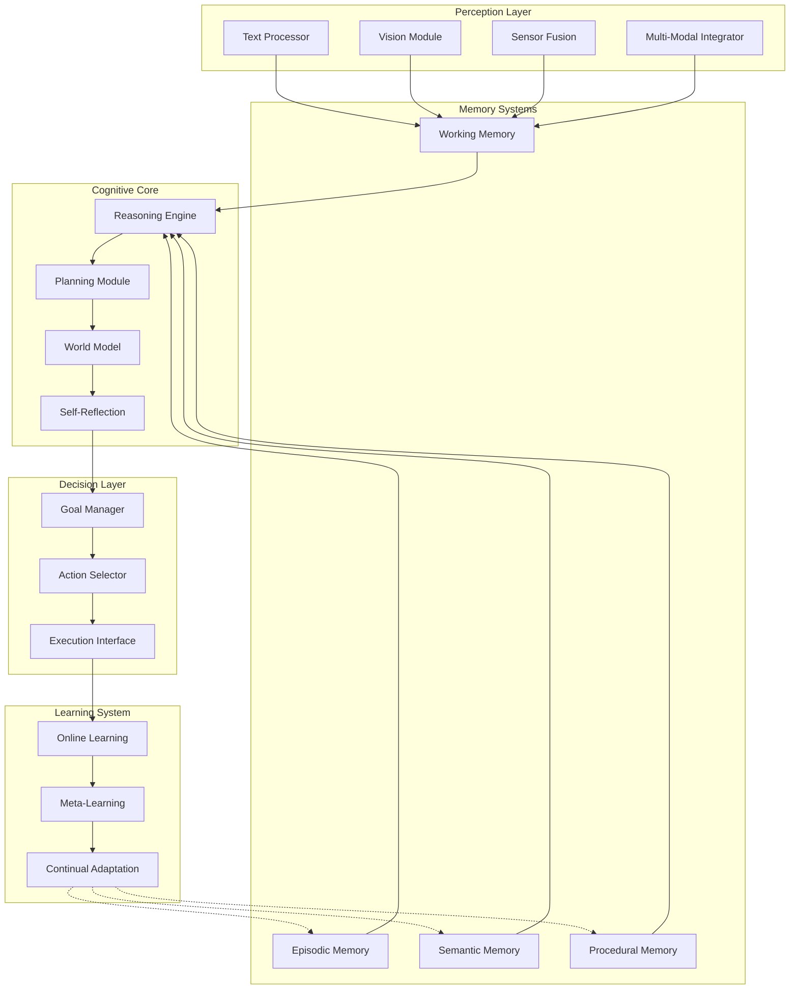

# AI Brain Architecture Overview

**Version:** 1.0  
**Last Updated:** November 2024  
**Status:** Design Phase

---

## Executive Summary

The AI Brain is a **modular cognitive architecture** designed to support autonomous intelligence across virtual and physical environments. Unlike single-purpose models, it integrates multiple specialized modules into a unified system capable of reasoning, planning, learning, and acting.

## Core Design Principles

1. **Modularity** — Each cognitive function is a distinct, replaceable module
2. **Composability** — Modules can be combined and reconfigured for different tasks
3. **Scalability** — Architecture supports growth from simple to complex capabilities
4. **Interpretability** — System behavior is explainable at multiple levels
5. **Safety** — Built-in mechanisms for alignment, oversight, and control
6. **Adaptability** — Continuous learning and improvement without catastrophic forgetting

## System Architecture

## Module Specifications

### 1. Perception Layer

**Purpose:** Convert raw inputs into structured representations

**Components:**
- **Text Processor** — Natural language understanding and generation
- **Vision Module** — Image/video understanding, object detection, scene parsing
- **Sensor Fusion** — Integration of robotics sensors (LIDAR, cameras, IMU, etc.)
- **Multi-Modal Integrator** — Unified representation across modalities

**Key Requirements:**
- Real-time processing capability
- Robust to noise and uncertainty
- Extensible to new sensor types
- Attention mechanisms for focus

**Research Questions:**
- How do we create unified representations across modalities?
- What attention mechanisms best support selective perception?
- How can we handle sensor failures gracefully?

### 2. Memory Systems

**Purpose:** Store and retrieve information across time scales

**Components:**

#### 2.1 Episodic Memory
- Stores specific experiences with temporal context
- Enables recall of past events
- Supports "what happened when" queries

#### 2.2 Semantic Memory
- Stores general knowledge and facts
- Knowledge graph representation
- Supports "what is X" queries

#### 2.3 Procedural Memory
- Stores learned skills and procedures
- Action sequences and motor programs
- Supports "how to do X" queries

#### 2.4 Working Memory
- Active context for current task
- Limited capacity, fast access
- Supports reasoning and planning

**Key Requirements:**
- Fast retrieval for working memory
- Efficient storage for long-term memories
- Memory consolidation mechanisms
- Forgetting strategies to prevent overload

**Research Questions:**
- How do we balance memory capacity with retrieval speed?
- What consolidation mechanisms prevent catastrophic forgetting?
- How do we implement selective forgetting?

### 3. Cognitive Core

**Purpose:** High-level reasoning, planning, and world modeling

**Components:**

#### 3.1 Reasoning Engine
- **Symbolic Reasoning** — Logic-based inference
- **Neural Reasoning** — Pattern-based inference
- **Causal Reasoning** — Understanding cause-effect relationships
- **Analogical Reasoning** — Transfer from similar situations

#### 3.2 Planning Module
- **Goal Decomposition** — Break high-level goals into sub-goals
- **Temporal Planning** — Schedule actions over time
- **Hierarchical Planning** — Multi-level abstraction
- **Replanning** — Adapt when plans fail

#### 3.3 World Model
- **State Representation** — Current world state
- **Dynamics Model** — Predict state transitions
- **Uncertainty Quantification** — Confidence in predictions
- **Counterfactual Reasoning** — "What if" scenarios

#### 3.4 Self-Reflection
- **Error Detection** — Identify mistakes and failures
- **Confidence Calibration** — Assess prediction reliability
- **Strategy Selection** — Choose reasoning approaches
- **Meta-Learning** — Learn how to learn better

**Key Requirements:**
- Scalable to complex problems
- Handles uncertainty and ambiguity
- Supports both fast and slow thinking
- Explainable reasoning chains

**Research Questions:**
- How do we combine symbolic and neural reasoning?
- What planning algorithms scale to long horizons?
- How do we build accurate world models?
- What enables effective self-reflection?

### 4. Decision & Action Layer

**Purpose:** Select and execute actions to achieve goals

**Components:**

#### 4.1 Goal Manager
- Maintains active goals and priorities
- Tracks goal progress
- Handles goal conflicts

#### 4.2 Action Selector
- Chooses actions based on current state and goals
- Considers uncertainty and risk
- Balances exploration and exploitation

#### 4.3 Execution Interface
- **Robotics Interface** — Control physical robots
- **Drone Interface** — Control aerial vehicles
- **Digital Agent Interface** — Control software agents
- **Multi-Platform Coordinator** — Coordinate across platforms

**Key Requirements:**
- Real-time action selection
- Robust to execution failures
- Supports both reactive and deliberative actions
- Safe operation guarantees

**Research Questions:**
- How do we balance immediate actions with long-term planning?
- What action selection algorithms work best?
- How do we ensure safe execution?

### 5. Learning & Adaptation

**Purpose:** Improve performance over time

**Components:**

#### 5.1 Online Learning
- Learn from immediate feedback
- Update models in real-time
- Adapt to changing environments

#### 5.2 Meta-Learning
- Learn how to learn
- Rapid adaptation to new tasks
- Few-shot learning capabilities

#### 5.3 Continual Adaptation
- Learn new skills without forgetting old ones
- Transfer learning across domains
- Self-improvement mechanisms

**Key Requirements:**
- Avoid catastrophic forgetting
- Efficient use of data
- Transfer learning across tasks
- Self-directed learning

**Research Questions:**
- How do we prevent catastrophic forgetting?
- What meta-learning approaches work best?
- How can the system learn autonomously?

## Information Flow

### Forward Pass (Perception → Action)

1. **Perception** receives raw inputs and converts to structured representations
2. **Working Memory** stores current context
3. **Reasoning Engine** processes information using episodic/semantic/procedural memory
4. **Planning Module** generates plans based on goals and world model
5. **Self-Reflection** evaluates plans and reasoning quality
6. **Decision Layer** selects actions
7. **Execution Interface** performs actions

### Backward Pass (Learning)

1. **Execution results** provide feedback
2. **Online Learning** updates models based on outcomes
3. **Memory Systems** consolidate new experiences
4. **Meta-Learning** improves learning strategies
5. **Self-Reflection** identifies improvement opportunities

## Integration Points

### Between Modules

- **Perception ↔ Memory:** Store perceived information, retrieve relevant memories
- **Memory ↔ Reasoning:** Provide context and knowledge for reasoning
- **Reasoning ↔ Planning:** Generate plans based on reasoning outcomes
- **Planning ↔ World Model:** Use world model for plan simulation
- **World Model ↔ Self-Reflection:** Evaluate model accuracy
- **Decision ↔ Execution:** Translate decisions into actions
- **Execution ↔ Learning:** Use outcomes for learning

### External Interfaces

- **Robotics:** ROS, PyBullet, MuJoCo
- **Drones:** MAVLink, DJI SDK
- **Digital Agents:** APIs, web interfaces, software frameworks
- **Data Sources:** Databases, APIs, file systems

## Scalability Considerations

### Horizontal Scaling
- Multiple agents can share memory systems
- Distributed reasoning across agents
- Parallel execution interfaces

### Vertical Scaling
- More sophisticated reasoning algorithms
- Larger memory capacities
- More complex world models

## Safety & Alignment

### Built-in Mechanisms

1. **Value Alignment** — Goals aligned with human values
2. **Oversight** — Human-in-the-loop monitoring
3. **Controllability** — Ability to pause, modify, or override
4. **Interpretability** — Explainable decisions and reasoning
5. **Robustness** — Handles edge cases and failures gracefully

## Next Steps

1. **Detailed Module Design** — Specify interfaces and implementations
2. **Prototype Development** — Build minimal viable system
3. **Experimentation** — Test individual modules and integration
4. **Iteration** — Refine based on results

## Module-Specific Documentation

### Detailed Module Designs
- **[Memory System Architecture](memory/memory-overview.md)** — Detailed memory architecture
- **[Reasoning Engine Architecture](reasoning/reasoning-core.md)** — Detailed reasoning architecture
- **[Safety Framework](safety/safety-overview.md)** — Safety and alignment mechanisms
- **[Planning Module](planning/)** — Planning architecture (coming soon)

### Concept Definitions
- **[Memory Concepts](../../docs/concepts/memory.md)** — Memory system concepts
- **[Reasoning Concepts](../../docs/concepts/reasoning.md)** — Reasoning concepts
- **[Planning Concepts](../../docs/concepts/planning.md)** — Planning concepts
- **[Safety Concepts](../../docs/concepts/safety.md)** — Safety concepts

## Related Research

- See `/papers/` for relevant research papers
- See `/notes/paper-summaries/` for concise paper summaries
- See `/experiments/` for experimental designs and results
- See `/notes/` for detailed technical notes
- See `/research-log/` for ongoing research discoveries

## Future Enhancements

### Memory v2 (Planned)
- Advanced consolidation mechanisms
- Improved retrieval algorithms
- Better integration between memory types
- See [Memory Overview](memory/memory-overview.md) for current design

### Reasoning v2 (Planned)
- Enhanced causal reasoning
- Better symbolic-neural integration
- Improved meta-reasoning
- See [Reasoning Core](reasoning/reasoning-core.md) for current design

### Safety Layers (Planned)
- Enhanced value alignment mechanisms
- Advanced verification procedures
- Improved interpretability
- See [Safety Overview](safety/safety-overview.md) for current design

### Added on 2024-11-24
- Module-specific documentation links
- Concept definition references
- Future enhancements section
- Enhanced cross-references

---

**Document Status:** Living document — updated as architecture evolves

