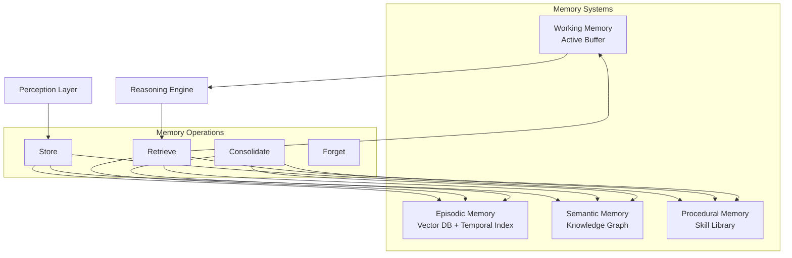

# Memory System Architecture

**Version:** 1.0  
**Last Updated:** November 2024  
**Status:** Design Phase

---

## Overview

The memory system provides the AI Brain with the ability to store, retrieve, and consolidate information across multiple time scales and contexts. It consists of four primary memory types: episodic, semantic, procedural, and working memory.

## Architecture

## Components

### Episodic Memory

**Storage:**
- Vector database for embeddings
- Temporal index for time-based queries
- Contextual metadata

**Retrieval:**
- Similarity search
- Temporal queries
- Contextual filtering

**Consolidation:**
- Experience summarization
- Pattern extraction
- Long-term storage

### Semantic Memory

**Storage:**
- Knowledge graph (entities, relations, properties)
- Fact database
- Concept hierarchies

**Retrieval:**
- Graph traversal
- Semantic search
- Query answering

**Consolidation:**
- Knowledge integration
- Conflict resolution
- Graph updates

### Procedural Memory

**Storage:**
- Skill representations
- Action sequences
- Procedure templates

**Retrieval:**
- Skill matching
- Procedure lookup
- Execution patterns

**Consolidation:**
- Skill refinement
- Procedure optimization
- Learning from execution

### Working Memory

**Storage:**
- Active context buffer
- Current task state
- Attention focus

**Operations:**
- Fast read/write
- Capacity management
- Context switching

## Integration Points

### With Perception Layer
- Stores perceived information
- Receives multi-modal inputs
- Maintains current context

### With Reasoning Engine
- Provides knowledge and context
- Supports inference
- Enables reasoning chains

### With Planning Module
- Retrieves relevant experiences
- Provides procedural knowledge
- Maintains plan context

### With Learning System
- Receives consolidation signals
- Updates memory representations
- Learns retrieval strategies

## Research Directions

1. **Memory Consolidation** - How to consolidate without forgetting
2. **Retrieval Mechanisms** - Efficient and accurate retrieval
3. **Memory Integration** - How memory types interact
4. **Capacity Management** - Balancing capacity and performance
5. **Selective Forgetting** - What to forget and when

## Related Documents

- [Memory Concept Definition](../../docs/concepts/memory.md)
- [Architecture Overview](../architecture-overview.md)
- See `/notes/` for research notes
- See `/papers/` for relevant papers
- See `/experiments/` for memory experiments

---

**Status:** Active Design

