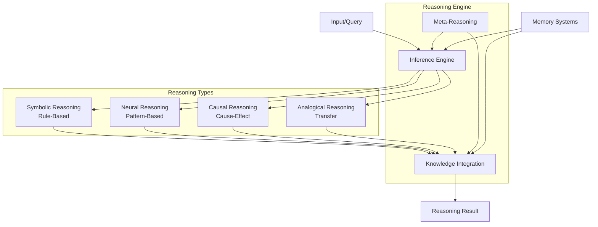

# Reasoning Engine Architecture

**Version:** 1.0  
**Last Updated:** November 2024  
**Status:** Design Phase

---

## Overview

The reasoning engine is the cognitive core that processes information, draws inferences, and generates logical conclusions. It integrates multiple reasoning paradigms to handle diverse problem types.

## Architecture

## Components

### Inference Engine

**Responsibilities:**
- Process reasoning tasks
- Select reasoning type
- Generate reasoning chains
- Validate conclusions

**Algorithms:**
- Forward/backward chaining (symbolic)
- Neural inference (pattern matching)
- Causal inference (causal models)
- Analogical matching (similarity)

### Knowledge Integration

**Responsibilities:**
- Combine information from memory
- Integrate multiple knowledge sources
- Resolve conflicts
- Maintain consistency

**Mechanisms:**
- Multi-source fusion
- Conflict resolution
- Consistency checking
- Knowledge alignment

### Meta-Reasoning

**Responsibilities:**
- Monitor reasoning quality
- Select reasoning strategies
- Detect errors
- Improve reasoning over time

**Capabilities:**
- Confidence estimation
- Strategy selection
- Error detection
- Learning from mistakes

## Reasoning Workflow

1. **Input Processing** - Receive query/task
2. **Reasoning Selection** - Choose appropriate reasoning type
3. **Knowledge Retrieval** - Get relevant information from memory
4. **Inference** - Generate reasoning chain
5. **Integration** - Combine multiple reasoning results
6. **Validation** - Check reasoning quality
7. **Output** - Return conclusion with confidence

## Integration Points

### With Memory Systems
- Retrieves knowledge and context
- Uses episodic memory for examples
- Uses semantic memory for facts
- Uses procedural memory for skills

### With Planning Module
- Generates plans using reasoning
- Evaluates plan feasibility
- Reasons about plan consequences

### With World Model
- Uses reasoning for prediction
- Reasons about state transitions
- Handles uncertainty

### With Self-Reflection
- Evaluates reasoning quality
- Identifies reasoning errors
- Improves reasoning strategies

## Research Directions

1. **Hybrid Reasoning** - Combining symbolic and neural
2. **Causal Reasoning** - Understanding cause-effect
3. **Analogical Transfer** - Learning from examples
4. **Meta-Reasoning** - Improving reasoning strategies
5. **Scalability** - Handling complex problems

## Related Documents

- [Reasoning Concept Definition](../../docs/concepts/reasoning.md)
- [Architecture Overview](../architecture-overview.md)
- See `/notes/` for research notes
- See `/papers/` for relevant papers
- See `/experiments/` for reasoning experiments

---

**Status:** Active Design

