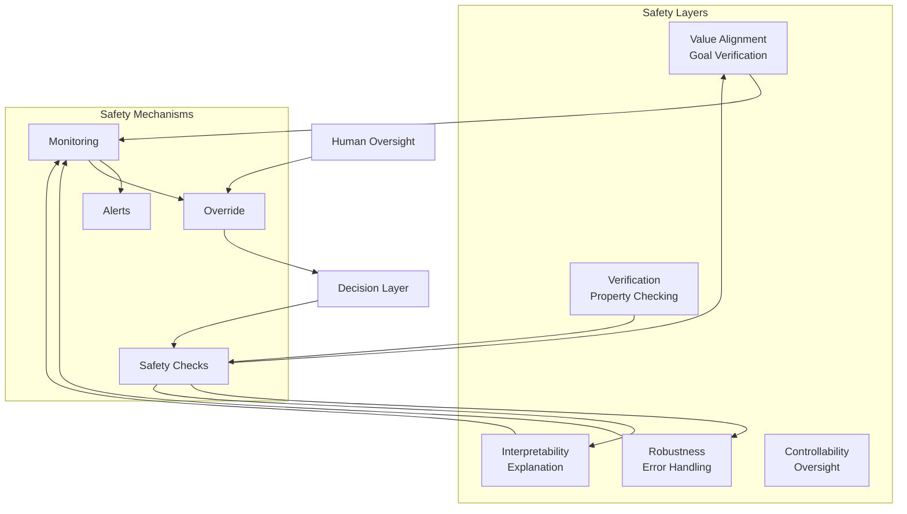

# Safety & Alignment Framework

**Version:** 1.0  
**Last Updated:** November 2024  
**Status:** Design Phase

---

## Overview

The safety and alignment framework ensures the AI Brain operates reliably, safely, and in alignment with human values. It includes multiple layers of safeguards, monitoring, and control mechanisms.

## Architecture

## Components

### Value Alignment

**Mechanisms:**
- Goal verification against values
- Value specification and learning
- Alignment monitoring
- Self-correction

**Implementation:**
- Constitutional principles
- Reward modeling
- Preference learning
- Value consistency checks

### Robustness

**Mechanisms:**
- Error handling and recovery
- Input validation
- Boundary checking
- Failure modes analysis

**Implementation:**
- Try-catch mechanisms
- Input sanitization
- Range checking
- Graceful degradation

### Interpretability

**Mechanisms:**
- Reasoning transparency
- Decision explanations
- Behavior analysis
- Debugging support

**Implementation:**
- Explanation generation
- Reasoning chain visualization
- Behavior logging
- Debug interfaces

### Controllability

**Mechanisms:**
- Human-in-the-loop
- Override capabilities
- Pause/resume
- Control interfaces

**Implementation:**
- Control APIs
- Override signals
- State management
- Human interfaces

### Verification

**Mechanisms:**
- Property checking
- Safety proofs
- Testing frameworks
- Validation procedures

**Implementation:**
- Formal verification
- Property testing
- Safety test suites
- Validation protocols

## Safety Workflow

1. **Pre-Action** - Safety checks before action
2. **During Action** - Continuous monitoring
3. **Post-Action** - Outcome verification
4. **On Alert** - Human notification and override
5. **On Failure** - Recovery and learning

## Integration Points

### With Decision Layer
- Implements safety checks
- Monitors decisions
- Enables overrides

### With Reasoning Engine
- Uses ethical reasoning
- Validates reasoning chains
- Checks for biases

### With Self-Reflection
- Monitors alignment
- Detects safety issues
- Triggers corrections

### With Learning System
- Learns from safety feedback
- Updates safety models
- Improves robustness

## Research Directions

1. **Value Specification** - How to specify human values
2. **Alignment Verification** - How to verify alignment
3. **Robustness** - Handling edge cases
4. **Interpretability** - Making behavior explainable
5. **Control** - Effective oversight mechanisms

## Related Documents

- [Safety Concept Definition](../../docs/concepts/safety.md)
- [Architecture Overview](../architecture-overview.md)
- See `/notes/` for research notes
- See `/papers/` for relevant papers
- See `/experiments/` for safety experiments

---

**Status:** Active Design

